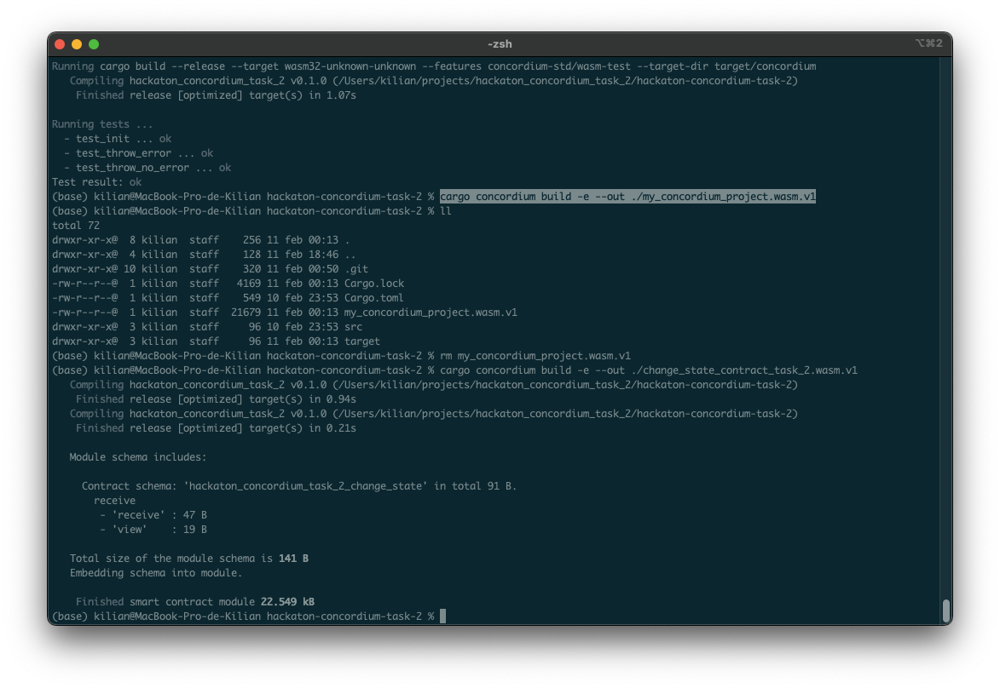
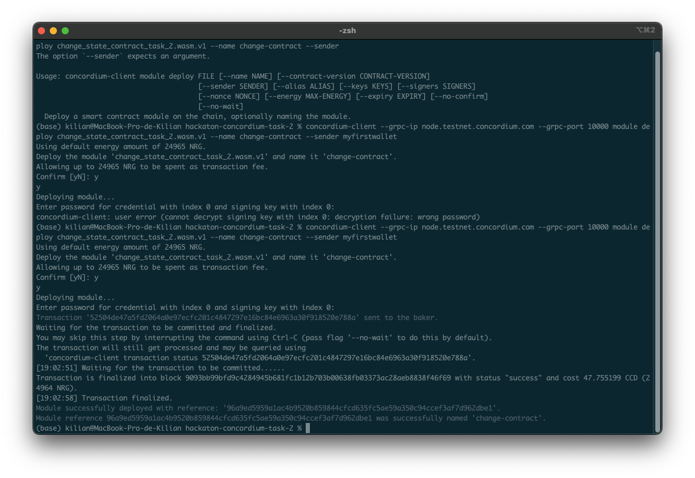
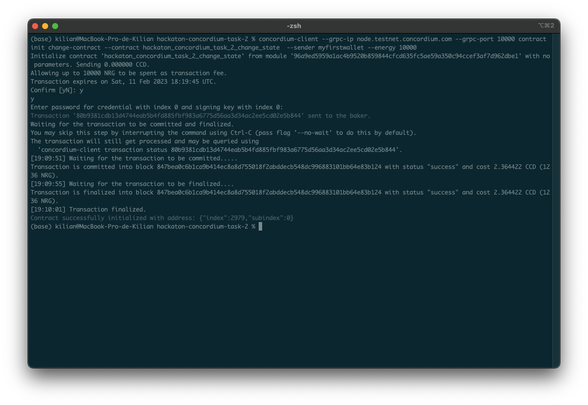
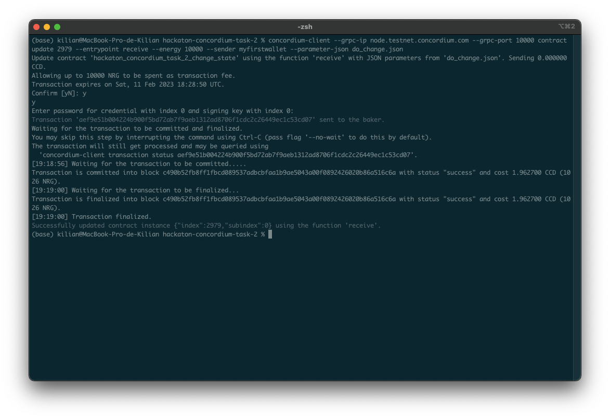
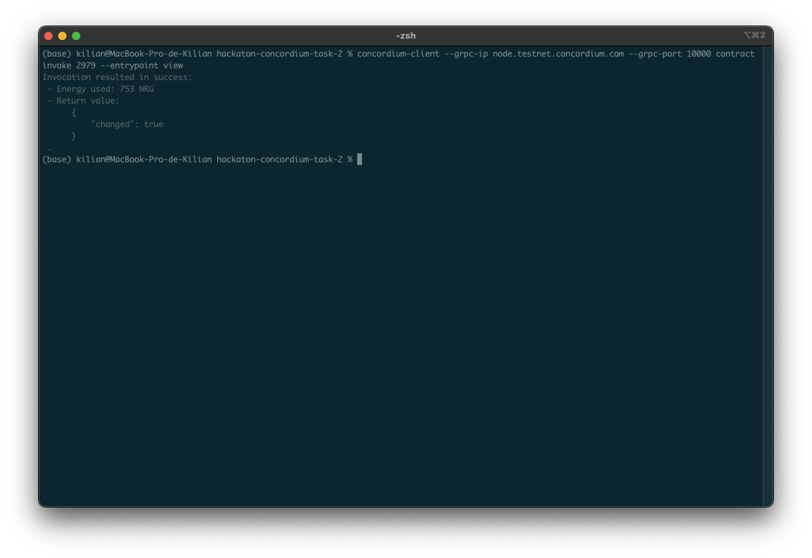

# TASK 2: Deploy Your First Smart Contract

Welcome to the task 2 of Concordium hackaton. This repository contains the second task of the hackaton which consists on creating and deploying the first contract.

I have created a contract which has one variable as status named `changed` of boolean type initialized as `false` when the contract is created. Once the variable is changed to `true` it can't be change again, so if you try it will raise an error.

## Compiling the contract

Once the contract is generated, I have compiled the project by executing the command `cargo concordium build -e --out ./my_concordium_project .wasm.vi`. See image below:



## Deploying the smart contract

By executing the command `concordium-client --grpc-ip node.testnet.concordium.com --grpc-port 10000 module deploy change_state_contract_task_2.wasm.v1 --name change-contract --sender myfirstwallet` I have deployed the contract. 

The transaction has is `52504de47a5fd2064a0e97ecfc201c4847297e16bc84e6963a30f918520e788a`.
The module reference is `96a9ed5959a1ac4b9520b859844cfcd635fc5ae59a350c94ccef3af7d962dbe1`.



## Init the smart contract

The command used to initialize the contract is:

```bash
concordium-client --grpc-ip node. testnet. concordium.com --grpc-port 10000 contract init change-contract --contract hackaton_concordium_task 2_change_state --sender myfirstwallet --energy 10000
```

The contract is initialized with the transaction hash `80b9381cdb13d4744eab5b4fd885fbf983a6775d56aa3d34ac2ee5cd02e5b844`.



## Update the smart contract

In order to update the smart contract I have created a file named `do_change.json` that contains a true value that will be sent to update the state of the Smart Contract.

`do_change.json`
```bash
(base) kilian@MacBook-Pro-de-Kilian hackaton-concordium-task-2 % cat do_change.json
true
```

The transaction hash of the update is `aef9e51b004224b900f5bd72ab7f9aeb1312ad8706f1cdc2c26449ec1c53cd07`.

The command used is:

```bash
concordium-client --grpc-ip node. testnet. concordium.com --grpc-port 10000 contract update 2979 --entrypoint receive --energy 10000 --sender myfirstwallet --parameter-json do_change. json
```



## Invoke the view function of the smart contract

Finally, I have invoked the view function of the Smart Contract to see its status. The command used is:

```bash
concordium-client --grpc-ip node.testnet.concordium.com --grpc-port 10000 contract invoke 2979 --entrypoint view
```


# Mainnet wallet

```bash
3adRr2QCtpcrg6MtqCHUiRSQQEwAKo59juMmkSHCkUgdpFHL2x
```
